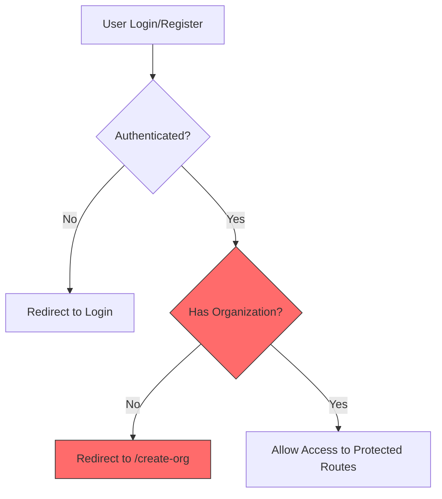

# Has Organization Check - Implementation Plan

## Overview

This plan addresses the missing "has organization" check in the authentication flow. Currently, users can access protected routes without having an organization, which breaks the multi-tenant architecture.

## Current State Analysis

### What's Missing



The red boxes indicate **missing logic**.

### Current Code Issues

| Component | File | Issue |
|-----------|------|-------|
| Backend Auth Response | `server/src/services/auth.service.ts` | Returns user without org data |
| Frontend Auth Store | `client/src/store/authStore.ts` | Does not fetch orgs after login |
| Register Page | `client/src/features/auth/pages/RegisterPage.tsx` | Blindly navigates to /dashboard |
| Protected Route | `client/src/components/auth/ProtectedRoute.tsx` | Only checks authentication |
| Org Store | `client/src/store/orgStore.ts` | Has fetchOrganizations but never called |

---

## Implementation Plan

### Approach: Frontend-Driven Organization Check

The frontend will fetch organizations immediately after authentication and redirect accordingly. This approach:
- Minimizes backend changes
- Leverages existing `/orgs` endpoint
- Keeps auth response lightweight

### Phase 1: Backend Changes

#### 1.1 Add `hasOrganization` Flag to Auth Response (Optional Enhancement)

**File:** `server/src/services/auth.service.ts`

```typescript
// Add to UserResponse interface
export interface UserResponse {
  id: string;
  email: string;
  firstName: string;
  lastName: string;
  fullName: string;
  avatar?: string;
  status: UserStatus;
  lastLoginAt?: Date;
  createdAt: Date;
  updatedAt: Date;
  hasOrganization: boolean;  // NEW
}

// Update toUserResponse function
export const toUserResponse = async (user: IUser): Promise<UserResponse> => {
  // Check if user has any organization membership
  const membershipCount = await Membership.countDocuments({
    userId: user.id,
    status: 'active',
    deletedAt: null,
  });

  return {
    id: user.id,
    email: user.email,
    firstName: user.firstName,
    lastName: user.lastName,
    fullName: `${user.firstName} ${user.lastName}`,
    avatar: user.avatar,
    status: user.status,
    lastLoginAt: user.lastLoginAt,
    createdAt: user.createdAt,
    updatedAt: user.updatedAt,
    hasOrganization: membershipCount > 0,
  };
};
```

**Note:** This is optional. The frontend can determine this by fetching organizations.

---

### Phase 2: Frontend Auth Store Changes

#### 2.1 Update Auth Store to Fetch Organizations After Login

**File:** `client/src/store/authStore.ts`

```typescript
import { useOrgStore } from './orgStore';

// Update register function
register: async (data: RegisterData) => {
  set({ isLoading: true });
  try {
    const response = await api.post<{ data: { user: User; accessToken: string } }>(
      '/auth/register',
      data
    );
    
    const { user, accessToken } = response.data.data;
    
    // Set access token in api module
    setAccessToken(accessToken);
    
    set({
      user,
      accessToken,
      isAuthenticated: true,
      isLoading: false,
    });

    // NEW: Fetch organizations after registration
    try {
      await useOrgStore.getState().fetchOrganizations();
    } catch {
      // Ignore org fetch errors - user might not have orgs yet
    }
  } catch (error) {
    set({ isLoading: false });
    throw error;
  }
},

// Update login function similarly
login: async (credentials: LoginCredentials) => {
  set({ isLoading: true });
  try {
    const response = await api.post<{ data: { user: User; accessToken: string } }>(
      '/auth/login',
      credentials
    );
    
    const { user, accessToken } = response.data.data;
    
    setAccessToken(accessToken);
    
    set({
      user,
      accessToken,
      isAuthenticated: true,
      isLoading: false,
    });

    // NEW: Fetch organizations after login
    try {
      await useOrgStore.getState().fetchOrganizations();
    } catch {
      // Ignore org fetch errors
    }
  } catch (error) {
    set({ isLoading: false });
    throw error;
  }
},
```

---

### Phase 3: Protected Route Changes

#### 3.1 Update ProtectedRoute Component

**File:** `client/src/components/auth/ProtectedRoute.tsx`

```typescript
import { Navigate, useLocation } from 'react-router-dom';
import { useAuthStore } from '@/store/authStore';
import { useOrgStore } from '@/store/orgStore';
import { useEffect, useState } from 'react';

interface ProtectedRouteProps {
  children: React.ReactNode;
  requireOrg?: boolean;  // NEW: Control whether org is required
}

export function ProtectedRoute({ children, requireOrg = true }: ProtectedRouteProps) {
  const { isAuthenticated, accessToken } = useAuthStore();
  const { organizations, isLoading: orgLoading, fetchOrganizations } = useOrgStore();
  const location = useLocation();
  const [orgCheckComplete, setOrgCheckComplete] = useState(false);

  // Fetch organizations if authenticated but not loaded
  useEffect(() => {
    if (isAuthenticated && accessToken && organizations.length === 0 && !orgLoading) {
      fetchOrganizations()
        .then(() => setOrgCheckComplete(true))
        .catch(() => setOrgCheckComplete(true));
    } else if (organizations.length > 0) {
      setOrgCheckComplete(true);
    }
  }, [isAuthenticated, accessToken, organizations.length, orgLoading]);

  // Not authenticated - redirect to login
  if (!isAuthenticated || !accessToken) {
    return <Navigate to="/login" state={{ from: location }} replace />;
  }

  // Show loading while checking organizations
  if (requireOrg && !orgCheckComplete) {
    return (
      <div className="min-h-screen flex items-center justify-center">
        <div className="animate-spin rounded-full h-8 w-8 border-b-2 border-indigo-600"></div>
      </div>
    );
  }

  // Authenticated but no organization - redirect to create-org
  // Skip for routes that don't require org
  if (requireOrg && organizations.length === 0) {
    return <Navigate to="/create-org" state={{ from: location }} replace />;
  }

  return <>{children}</>;
}
```

#### 3.2 Update AuthRoute Component

**File:** `client/src/components/auth/ProtectedRoute.tsx`

```typescript
// Keep existing AuthRoute but add org check for proper redirect
export function AuthRoute({ children }: AuthRouteProps) {
  const { isAuthenticated, accessToken } = useAuthStore();
  const { organizations } = useOrgStore();

  // Already authenticated
  if (isAuthenticated && accessToken) {
    // Has organization - go to dashboard
    if (organizations.length > 0) {
      return <Navigate to="/dashboard" replace />;
    }
    // No organization - go to create-org
    return <Navigate to="/create-org" replace />;
  }

  return <>{children}</>;
}
```

---

### Phase 4: Router Changes

#### 4.1 Update Route Definitions

**File:** `client/src/router/index.tsx`

```typescript
// Routes that DO NOT require organization
const routesWithoutOrg = ['/create-org', '/no-org', '/accept-invitation', '/settings/profile'];

// Update route definitions
{
  path: '/create-org',
  element: (
    <ProtectedRoute requireOrg={false}>
      <CreateOrgPage />
    </ProtectedRoute>
  ),
},
{
  path: '/no-org',
  element: (
    <ProtectedRoute requireOrg={false}>
      <NoOrgPage />
    </ProtectedRoute>
  ),
},
{
  path: '/accept-invitation',
  element: (
    <ProtectedRoute requireOrg={false}>
      <AcceptInvitationPage />
    </ProtectedRoute>
  ),
},
{
  path: '/settings/profile',
  element: (
    <ProtectedRoute requireOrg={false}>
      <ProfileSettingsPage />
    </ProtectedRoute>
  ),
},

// All other protected routes use default requireOrg={true}
{
  path: '/dashboard',
  element: (
    <ProtectedRoute>
      <DashboardPage />
    </ProtectedRoute>
  ),
},
```

---

### Phase 5: Page Component Changes

#### 5.1 Update RegisterPage Navigation

**File:** `client/src/features/auth/pages/RegisterPage.tsx`

```typescript
import { useNavigate, Link } from 'react-router-dom';
import { useRegister } from '../api/useAuth';
import { useOrgStore } from '@/store/orgStore';

export default function RegisterPage() {
  const navigate = useNavigate();
  const registerMutation = useRegister();
  const { organizations } = useOrgStore();

  const handleSubmit = async (e: React.FormEvent) => {
    e.preventDefault();
    setError('');

    // ... validation ...

    try {
      await registerMutation.mutateAsync({
        email: formData.email,
        password: formData.password,
        firstName: formData.firstName,
        lastName: formData.lastName,
      });

      // Navigate based on organization status
      // The auth store already fetched organizations
      const updatedOrgs = useOrgStore.getState().organizations;
      if (updatedOrgs.length > 0) {
        navigate(`/${updatedOrgs[0].org.slug}/dashboard`);
      } else {
        navigate('/create-org');
      }
    } catch (err: any) {
      setError(err.response?.data?.message || 'Registration failed');
    }
  };

  // ... rest of component
}
```

#### 5.2 Update LoginPage Navigation

**File:** `client/src/features/auth/pages/LoginPage.tsx`

```typescript
// Similar changes to RegisterPage
// Navigate based on organization status after login
```

#### 5.3 Update CreateOrgPage Navigation

**File:** `client/src/features/org/pages/CreateOrgPage.tsx`

```typescript
import { useNavigate } from 'react-router-dom';
import { useCreateOrganization } from '../api/useOrg';

export default function CreateOrgPage() {
  const navigate = useNavigate();
  const createOrgMutation = useCreateOrganization();

  const handleCreate = async (data: CreateOrgInput) => {
    try {
      const result = await createOrgMutation.mutateAsync(data);
      // Navigate to the new organization's dashboard
      navigate(`/${result.org.slug}/dashboard`, { replace: true });
    } catch (err: any) {
      setError(err.response?.data?.message || 'Failed to create organization');
    }
  };

  // ... rest of component
}
```

---

### Phase 6: App Initialization

#### 6.1 Add Auth Initialization on App Load

**File:** `client/src/main.tsx` or create new `AuthProvider.tsx`

```typescript
// Option A: Add to main.tsx
import { useAuthStore } from '@/store/authStore';
import { useOrgStore } from '@/store/orgStore';
import { setAccessToken } from '@/lib/api';

// Initialize auth state from persisted storage
const accessToken = useAuthStore.getState().accessToken;
if (accessToken) {
  setAccessToken(accessToken);
  // Fetch organizations if authenticated
  useOrgStore.getState().fetchOrganizations().catch(() => {});
}
```

```typescript
// Option B: Create AuthProvider component
// client/src/providers/AuthProvider.tsx
import { useEffect } from 'react';
import { useAuthStore } from '@/store/authStore';
import { useOrgStore } from '@/store/orgStore';
import { setAccessToken } from '@/lib/api';

export function AuthProvider({ children }: { children: React.ReactNode }) {
  useEffect(() => {
    // Sync API module with persisted token
    const accessToken = useAuthStore.getState().accessToken;
    if (accessToken) {
      setAccessToken(accessToken);
      useOrgStore.getState().fetchOrganizations().catch(() => {});
    }
  }, []);

  return <>{children}</>;
}
```

---

## Implementation Order

1. **Phase 6**: App Initialization (fixes session persistence)
2. **Phase 3**: ProtectedRoute changes
3. **Phase 4**: Router changes
4. **Phase 2**: Auth store changes
5. **Phase 5**: Page component changes
6. **Phase 1**: Backend changes (optional enhancement)

---

## Testing Checklist

- [ ] New user registration redirects to /create-org
- [ ] User with existing org redirects to org dashboard
- [ ] Page refresh maintains auth state
- [ ] Page refresh maintains org state
- [ ] Direct access to protected routes without org redirects to /create-org
- [ ] /create-org, /no-org, /accept-invitation accessible without org
- [ ] After creating org, user redirects to org dashboard
- [ ] Login with user who has orgs redirects correctly
- [ ] Login with user who has no orgs redirects to /create-org

---

## Files to Modify

### Backend
- `server/src/services/auth.service.ts` - Add hasOrganization flag (optional)

### Frontend
- `client/src/store/authStore.ts` - Fetch orgs after login/register
- `client/src/store/orgStore.ts` - Ensure fetchOrganizations works correctly
- `client/src/components/auth/ProtectedRoute.tsx` - Add org check
- `client/src/router/index.tsx` - Set requireOrg prop on routes
- `client/src/features/auth/pages/RegisterPage.tsx` - Update navigation
- `client/src/features/auth/pages/LoginPage.tsx` - Update navigation
- `client/src/features/org/pages/CreateOrgPage.tsx` - Update navigation
- `client/src/main.tsx` - Add auth initialization (or create AuthProvider)
