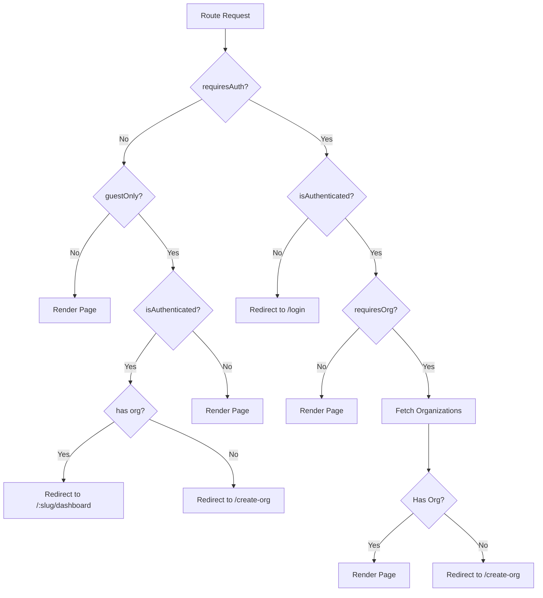
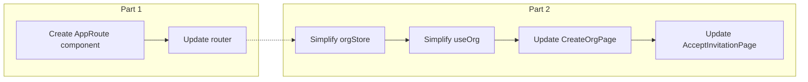

# Refactoring Plan: Unified Route Guard & Simplified Org Management

## Overview

This plan is split into **two parts** that can be implemented independently:

1. **Part 1**: Combine `AuthRoute` and `ProtectedRoute` into a single `AppRoute` component
2. **Part 2**: Simplify `orgStore` and `useOrg` to only fetch organizations

---

# Part 1: Combining AuthRoute and ProtectedRoute

## Current State

Two separate components with overlapping logic:

| Component | Purpose | Location |
|-----------|---------|----------|
| `AuthRoute` | Redirect authenticated users away from login/register | [`ProtectedRoute.tsx:59-74`](client/src/components/auth/ProtectedRoute.tsx:59) |
| `ProtectedRoute` | Protect routes, check auth + org requirements | [`ProtectedRoute.tsx:11-49`](client/src/components/auth/ProtectedRoute.tsx:11) |

## Proposed Unified Component



## New Component Interface

```typescript
// components/auth/AppRoute.tsx
interface AppRouteProps {
  children: React.ReactNode;
  requiresAuth?: boolean;   // Default: true - route needs authentication
  requiresOrg?: boolean;    // Default: false - route needs organization
  guestOnly?: boolean;      // Default: false - only for non-authenticated users (login/register)
}
```

## Files to Modify in Part 1

### 1. `client/src/components/auth/ProtectedRoute.tsx` → Rename to `AppRoute.tsx`

**Action**: Replace entire file with new unified component

**New Implementation**:
```typescript
import { Navigate, useLocation } from 'react-router-dom';
import { useAuthStore } from '@/store/authStore';
import { useOrgStore } from '@/store/orgStore';
import { useEffect, useState } from 'react';

interface AppRouteProps {
  children: React.ReactNode;
  requiresAuth?: boolean;   // Default: true
  requiresOrg?: boolean;    // Default: false
  guestOnly?: boolean;      // Default: false
}

function LoadingSpinner() {
  return (
    <div className="min-h-screen flex items-center justify-center">
      <div className="animate-spin rounded-full h-8 w-8 border-b-2 border-indigo-600"></div>
    </div>
  );
}

export function AppRoute({ 
  children, 
  requiresAuth = true, 
  requiresOrg = false,
  guestOnly = false 
}: AppRouteProps) {
  const { isAuthenticated, accessToken } = useAuthStore();
  const { organizations, isLoading: orgLoading, fetchOrganizations } = useOrgStore();
  const location = useLocation();
  const [orgCheckComplete, setOrgCheckComplete] = useState(false);

  // Fetch organizations if needed
  useEffect(() => {
    if (requiresAuth && isAuthenticated && requiresOrg && organizations.length === 0 && !orgLoading) {
      fetchOrganizations()
        .then(() => setOrgCheckComplete(true))
        .catch(() => setOrgCheckComplete(true));
    } else if (!requiresOrg || organizations.length > 0) {
      setOrgCheckComplete(true);
    }
  }, [requiresAuth, requiresOrg, isAuthenticated, organizations.length, orgLoading]);

  // Guest-only routes (login/register) - redirect if authenticated
  if (guestOnly) {
    if (isAuthenticated && accessToken) {
      const destination = organizations.length > 0 
        ? `/${organizations[0].org.slug}/dashboard` 
        : '/create-org';
      return <Navigate to={destination} replace />;
    }
    return <>{children}</>;
  }

  // No auth required - render immediately
  if (!requiresAuth) {
    return <>{children}</>;
  }

  // Auth required but not authenticated
  if (!isAuthenticated || !accessToken) {
    return <Navigate to="/login" state={{ from: location }} replace />;
  }

  // Authenticated, no org required
  if (!requiresOrg) {
    return <>{children}</>;
  }

  // Org required but still loading
  if (!orgCheckComplete) {
    return <LoadingSpinner />;
  }

  // Org required but no org found
  if (organizations.length === 0) {
    return <Navigate to="/no-org" state={{ from: location }} replace />;
  }

  // All checks passed
  return <>{children}</>;
}
```

### 2. `client/src/router/index.tsx`

**Action**: Update imports and route configurations

**Changes**:
```typescript
// Before
import { ProtectedRoute, AuthRoute } from '@/components/auth/ProtectedRoute';

// After
import { AppRoute } from '@/components/auth/AppRoute';

// Route examples:
// Guest-only (login/register)
{ path: '/login', element: <AppRoute guestOnly><LoginPage /></AppRoute> },

// Authenticated, no org required
{ path: '/create-org', element: <AppRoute requiresOrg={false}><CreateOrgPage /></AppRoute> },
{ path: '/no-org', element: <AppRoute requiresOrg={false}><NoOrgPage /></AppRoute> },

// Authenticated + org required
{ path: '/dashboard', element: <AppRoute requiresOrg><DashboardPage /></AppRoute> },
```

## Part 1 Summary

| File | Action |
|------|--------|
| `client/src/components/auth/ProtectedRoute.tsx` | Rename to `AppRoute.tsx`, replace with new implementation |
| `client/src/router/index.tsx` | Update imports and route wrappers |

---

# Part 2: Simplifying Organization Management

## What to Keep

Only the organization fetching functionality:

| Keep | Purpose |
|------|---------|
| `fetchOrganizations()` | Get user's organizations |
| `organizations` state | Store fetched orgs |
| `currentOrg` state | Track selected org |
| `setCurrentOrg()` | Switch between orgs |
| `isLoading` state | Loading indicator |
| `useOrganizations` hook | React Query for fetching |
| `useOrganization` hook | React Query for single org |

## What to Remove

### From `orgStore.ts`

| Remove | Type | Reason |
|--------|------|--------|
| `currentMembership` | State | Not needed now |
| `createOrganization()` | Action | No frontend org creation |
| `updateOrganization()` | Action | No frontend org updates |
| `getOrganizationMembers()` | Action | Not needed now |
| `inviteMember()` | Action | Not needed now |
| `acceptInvitation()` | Action | Not needed now |
| `cancelInvitation()` | Action | Not needed now |
| `removeMember()` | Action | Not needed now |
| `updateMemberRole()` | Action | Not needed now |
| `setCurrentMembership()` | Action | Not needed now |

### From `useOrg.ts`

| Remove | Reason |
|--------|--------|
| `orgApi.createOrganization` | No frontend org creation |
| `orgApi.updateOrganization` | Not needed now |
| `orgApi.getMembers` | Not needed now |
| `orgApi.inviteMember` | Not needed now |
| `orgApi.getInvitations` | Not needed now |
| `orgApi.acceptInvitation` | Not needed now |
| `orgApi.updateMemberRole` | Not needed now |
| `orgApi.removeMember` | Not needed now |
| `orgApi.cancelInvitation` | Not needed now |
| `useCreateOrganization` | No frontend org creation |
| `useUpdateOrganization` | Not needed now |
| `useOrganizationMembers` | Not needed now |
| `useInviteMember` | Not needed now |
| `useOrganizationInvitations` | Not needed now |
| `useAcceptInvitation` | Not needed now |
| `useUpdateMemberRole` | Not needed now |
| `useRemoveMember` | Not needed now |
| `useCancelInvitation` | Not needed now |

## Files to Modify in Part 2

### 1. `client/src/store/orgStore.ts`

**Action**: Simplify to only fetch and store organizations

**New Implementation**:
```typescript
import { create } from 'zustand';
import { persist } from 'zustand/middleware';
import type { Organization, UserOrg } from '../types/org.types';
import { api } from '../lib/api';

interface OrgState {
  organizations: UserOrg[];
  currentOrg: Organization | null;
  isLoading: boolean;
}

interface OrgActions {
  fetchOrganizations: () => Promise<void>;
  setCurrentOrg: (org: Organization | null) => void;
  setLoading: (loading: boolean) => void;
  clearOrg: () => void;
}

type OrgStore = OrgState & OrgActions;

export const useOrgStore = create<OrgStore>()(
  persist(
    (set, get) => ({
      // Initial state
      organizations: [],
      currentOrg: null,
      isLoading: false,

      setLoading: (loading: boolean) => {
        set({ isLoading: loading });
      },

      clearOrg: () => {
        set({
          currentOrg: null,
        });
      },

      fetchOrganizations: async () => {
        set({ isLoading: true });
        try {
          const response = await api.get<{ data: UserOrg[] }>('/orgs');
          const orgs = response.data.data;
          
          set({
            organizations: orgs,
            isLoading: false,
          });

          // Set current org if not set and orgs exist
          const currentOrg = get().currentOrg;
          if (!currentOrg && orgs.length > 0) {
            set({ currentOrg: orgs[0].org });
          }
        } catch (error) {
          set({ isLoading: false });
          throw error;
        }
      },

      setCurrentOrg: (org: Organization | null) => {
        set({ currentOrg: org });
      },
    }),
    {
      name: 'org-storage',
      partialize: (state) => ({
        currentOrg: state.currentOrg,
      }),
    }
  )
);
```

### 2. `client/src/features/org/api/useOrg.ts`

**Action**: Simplify to only fetching hooks

**New Implementation**:
```typescript
import { useQuery } from '@tanstack/react-query';
import { useAuthStore } from '@/store/authStore';
import { api } from '@/lib/api';
import type { Organization, UserOrg } from '@/types/org.types';

// API functions
const orgApi = {
  getOrganizations: async () => {
    const response = await api.get<{ data: UserOrg[] }>('/orgs');
    return response.data.data;
  },

  getOrganization: async (orgSlug: string) => {
    const response = await api.get<{ data: Organization }>(`/orgs/${orgSlug}`);
    return response.data.data;
  },
};

// Hooks
export const useOrganizations = () => {
  const { accessToken } = useAuthStore();
  
  return useQuery({
    queryKey: ['organizations'],
    queryFn: orgApi.getOrganizations,
    enabled: !!accessToken,
    staleTime: 5 * 60 * 1000, // 5 minutes
  });
};

export const useOrganization = (orgSlug: string) => {
  return useQuery({
    queryKey: ['organization', orgSlug],
    queryFn: () => orgApi.getOrganization(orgSlug),
    enabled: !!orgSlug,
  });
};
```

### 3. `client/src/features/org/pages/CreateOrgPage.tsx`

**Action**: Remove imports and usage of deleted store actions/hooks

**Changes Needed**:
- Remove `useCreateOrganization` import and usage
- The page can remain as a placeholder or be updated to show instructions for creating org via other means

### 4. `client/src/features/org/pages/AcceptInvitationPage.tsx`

**Action**: Remove imports and usage of deleted store actions/hooks

**Changes Needed**:
- Remove `useAcceptInvitation` import and usage
- The page can remain as a placeholder or be updated

### 5. `client/src/types/org.types.ts`

**Action**: Keep as-is (types may be needed later)

## Part 2 Summary

| File | Action |
|------|--------|
| `client/src/store/orgStore.ts` | Remove unused actions and state |
| `client/src/features/org/api/useOrg.ts` | Remove unused API functions and hooks |
| `client/src/features/org/pages/CreateOrgPage.tsx` | Remove usage of deleted hooks |
| `client/src/features/org/pages/AcceptInvitationPage.tsx` | Remove usage of deleted hooks |

---

# Implementation Order



**Parts can be implemented independently**, but Part 2 should follow Part 1 for cleaner codebase.

---

# Final Route Structure

After both parts are implemented:

```typescript
export const router = createBrowserRouter([
  // Guest-only routes (redirect if authenticated)
  { path: '/login', element: <AppRoute guestOnly><LoginPage /></AppRoute> },
  { path: '/register', element: <AppRoute guestOnly><RegisterPage /></AppRoute> },

  // Authenticated routes without org requirement
  { path: '/create-org', element: <AppRoute requiresOrg={false}><CreateOrgPage /></AppRoute> },
  { path: '/no-org', element: <AppRoute requiresOrg={false}><NoOrgPage /></AppRoute> },
  { path: '/accept-invitation', element: <AppRoute requiresOrg={false}><AcceptInvitationPage /></AppRoute> },
  { path: '/settings/profile', element: <AppRoute requiresOrg={false}><ProfileSettingsPage /></AppRoute> },

  // Authenticated routes with org requirement
  { path: '/dashboard', element: <AppRoute requiresOrg><DashboardPage /></AppRoute> },
  { path: '/:orgSlug/dashboard', element: <AppRoute requiresOrg><OrgDashboardPage /></AppRoute> },
  { path: '/:orgSlug/tests', element: <AppRoute requiresOrg><TestListPage /></AppRoute> },

  // Redirects
  { path: '/', element: <Navigate to="/dashboard" replace /> },
  { path: '*', element: <NotFoundPage /> },
]);
```

---

# Summary

| Category | Before | After |
|----------|--------|-------|
| Route guard components | 2 (AuthRoute, ProtectedRoute) | 1 (AppRoute) |
| orgStore actions | 10 | 4 |
| useOrg hooks | 10 | 2 |
| Pages kept | All | All (CreateOrgPage, NoOrgPage, AcceptInvitationPage remain) |
