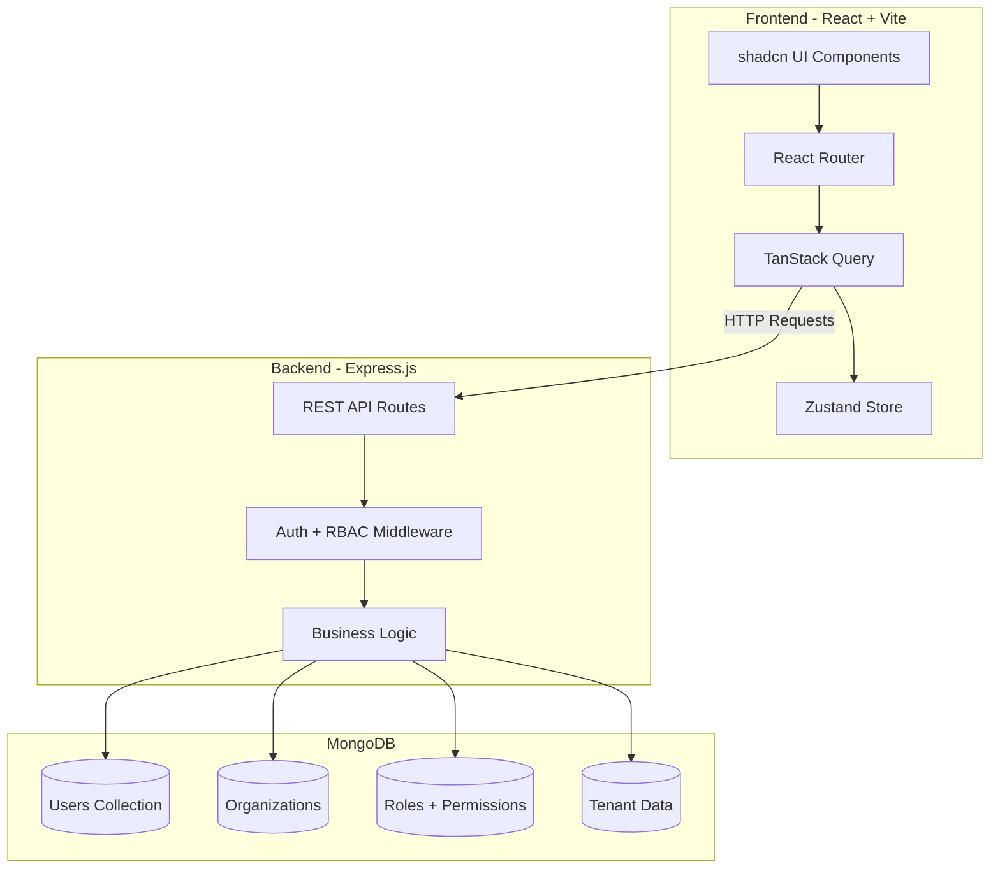
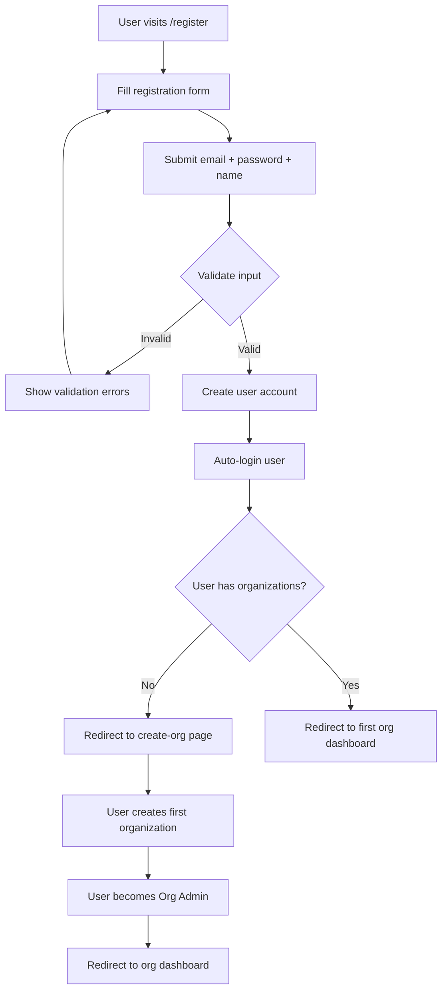
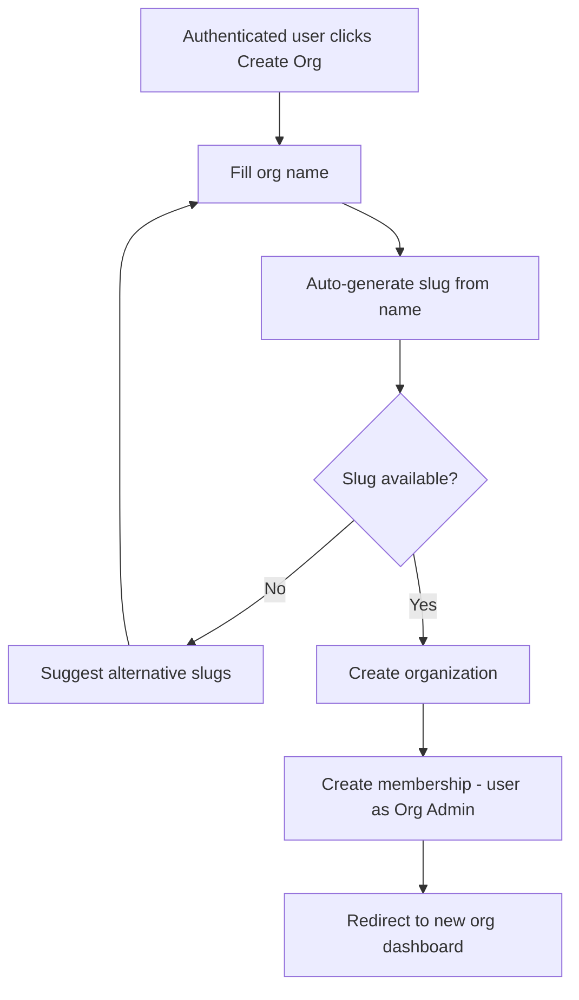
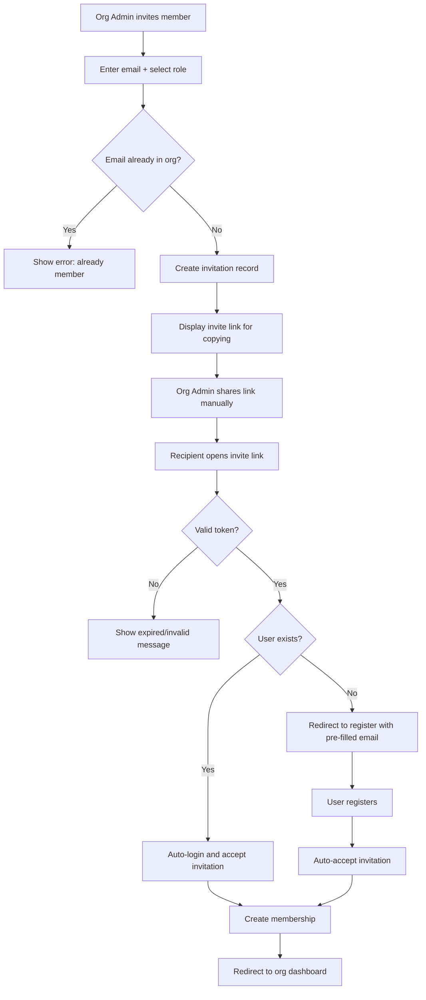
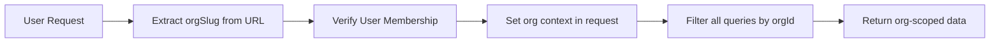
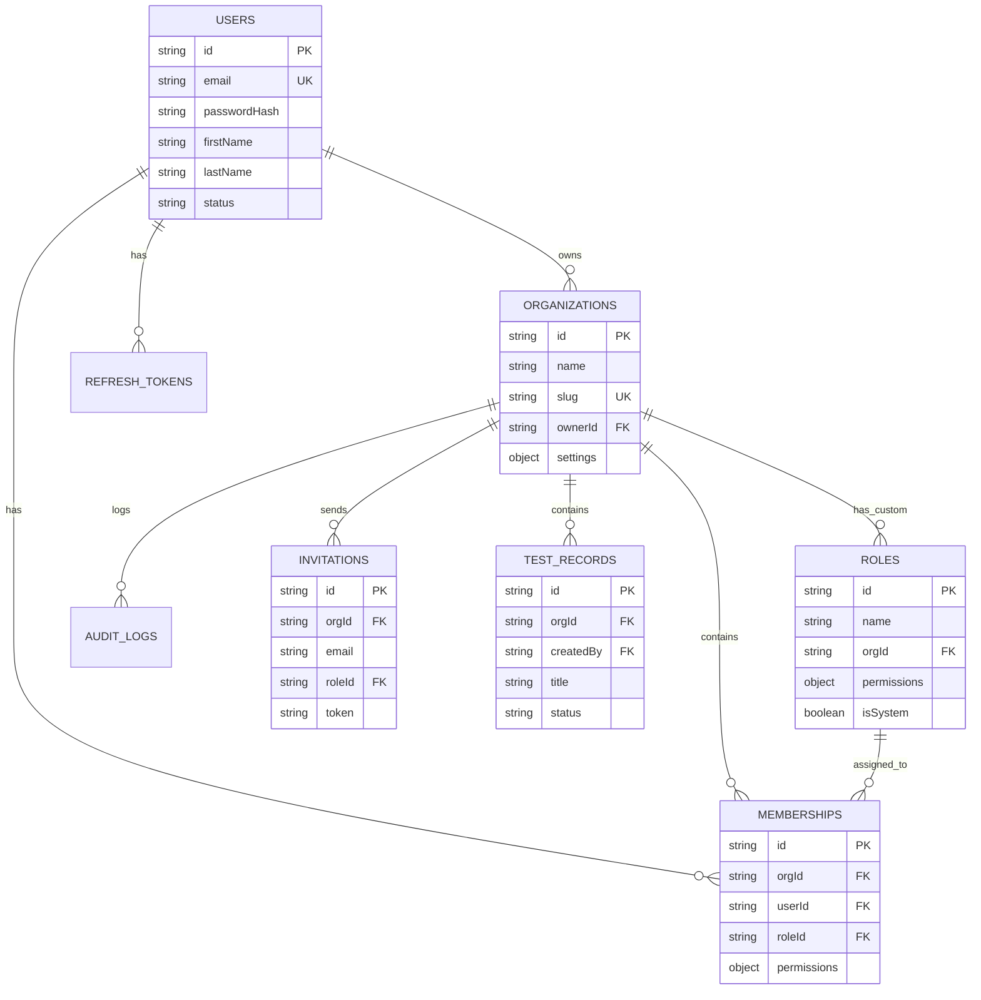
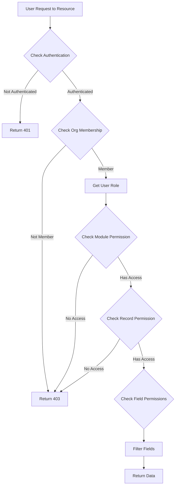

# MERN Multi-Tenant RBAC Starter Template - Architecture Plan

## Project Overview

A production-ready MERN stack starter template with multi-tenancy, role-based access control (RBAC) at module, record, and field levels, JWT authentication, and protected routes.

---

## Tech Stack

### Backend
- **Runtime**: Node.js with Express.js
- **Database**: MongoDB with Mongoose ODM
- **Authentication**: JWT (Access + Refresh Tokens)
- **Validation**: Zod schemas
- **Security**: Helmet, CORS, Rate Limiting

### Frontend
- **Framework**: React 18+ with Vite
- **UI Library**: shadcn/ui (Radix UI + Tailwind CSS)
- **State Management**: Zustand (global state) + TanStack Query (server state)
- **Routing**: React Router v6 with protected routes
- **Form Handling**: React Hook Form + Zod resolver

---

## System Architecture



---

## User Flows

### Registration Flow (Open Registration)


### Organization Creation Flow


### Member Invitation Flow


> **Note**: For MVP, invite links are displayed in the UI for manual sharing (no email sending). Email integration can be added later.

---

## Multi-Tenancy Architecture

### Approach: Shared Database with tenant_id
- Every collection includes `orgId` field
- Frontend URL pattern: `app.domain.com/:orgSlug/module`
- Middleware automatically filters queries by current organization
- MongoDB transactions ensure data consistency across operations

### Organization Context Flow



---

## Database Schema Design

### Core Collections

> **Note**: All IDs are numeric-only strings (e.g., `5508400294146716446655440000`) generated using a custom numeric ID generator. This provides cleaner APIs and better readability.

#### 1. Users Collection
```javascript
{
  id: String, // Numeric ID, primary key
  email: String, // unique, indexed
  passwordHash: String,
  firstName: String,
  lastName: String,
  avatar: String,
  status: Enum[active, inactive, suspended],
  lastLoginAt: Date,
  createdAt: Date,
  updatedAt: Date,
  deletedAt: Date // Soft delete
}
```

> **Note**: Email verification removed for MVP. Users can register and immediately access all features.

#### 2. Organizations Collection
```javascript
{
  id: String, // Numeric ID, primary key
  name: String,
  slug: String, // unique, indexed - for URL
  logo: String,
  ownerId: String, // Numeric ID, ref: Users
  settings: {
    theme: Object,
    features: Object
  },
  createdAt: Date,
  updatedAt: Date,
  deletedAt: Date // Soft delete
}
```

> **Note**: Subscription fields removed for MVP. Can be added later for billing integration.

#### 3. Organization Memberships Collection
```javascript
{
  id: String, // Numeric ID, primary key
  orgId: String, // Numeric ID, ref: Organizations
  userId: String, // Numeric ID, ref: Users
  roleId: String, // Numeric ID, ref: Roles
  permissions: {
    // Permission overrides at membership level
    modules: {
      [moduleName]: {
        read: Boolean,
        write: Boolean,
        delete: Boolean
      }
    },
    // Field-level permission overrides
    fields: {
      [moduleName]: {
        [fieldName]: {
          read: Boolean,
          write: Boolean
        }
      }
    }
  },
  invitedBy: String, // Numeric ID, ref: Users
  joinedAt: Date,
  status: Enum[active, inactive],
  createdAt: Date,
  updatedAt: Date,
  deletedAt: Date // Soft delete
}
```

> **Note**: Membership permissions override role permissions. Undefined permissions fall back to role defaults.

#### 4. Roles Collection (System-defined + Custom)
```javascript
{
  id: String, // Numeric ID, primary key
  name: String, // org_admin, manager, technician
  displayName: String,
  isSystem: Boolean, // Cannot be deleted
  orgId: String, // Numeric ID, null for system roles, ID for custom org roles
  permissions: {
    modules: {
      [moduleName]: {
        read: Boolean,
        write: Boolean,
        delete: Boolean,
        // Record-level filter
        recordScope: Enum[all, own] // Can only access own records
      }
    },
    fields: {
      [moduleName]: {
        [fieldName]: {
          read: Boolean,
          write: Boolean
        }
      }
    }
  },
  createdAt: Date,
  updatedAt: Date,
  deletedAt: Date // Soft delete
}
```

> **Note**: System roles (org_admin, manager, technician) are seeded on first deployment. Custom roles can be created by Org Admins.

#### 5. Refresh Tokens Collection
```javascript
{
  id: String, // Numeric ID, primary key
  token: String, // hashed
  userId: String, // Numeric ID, ref: Users
  orgId: String, // Numeric ID, current org context
  userAgent: String,
  ipAddress: String,
  expiresAt: Date,
  createdAt: Date
}
```

#### 6. Audit Logs Collection
```javascript
{
  id: String, // Numeric ID, primary key
  orgId: String, // Numeric ID, ref: Organizations
  userId: String, // Numeric ID, ref: Users
  action: String, // create, update, delete, login, etc.
  module: String, // users, organizations, members, etc.
  recordId: String, // Numeric ID of the affected record
  changes: {
    before: Object,
    after: Object
  },
  ipAddress: String,
  createdAt: Date
}
```

#### 7. Invitations Collection
```javascript
{
  id: String, // Numeric ID, primary key
  orgId: String, // Numeric ID, ref: Organizations
  email: String, // Invited email
  roleId: String, // Numeric ID, ref: Roles
  invitedBy: String, // Numeric ID, ref: Users
  token: String, // Unique invitation token
  expiresAt: Date,
  status: Enum[pending, accepted, expired],
  createdAt: Date
}
```

#### 8. Test Records Collection (Test Module)
```javascript
{
  id: String, // Numeric ID, primary key
  orgId: String, // Numeric ID, ref: Organizations
  createdBy: String, // Numeric ID, ref: Users - for "own" record permission
  title: String,
  description: String,
  status: Enum[draft, published, archived],
  priority: Enum[low, medium, high],
  // Fields for demonstrating field-level permissions
  notes: String, // Visible to all with read permission
  internalNotes: String, // Only visible to managers and admins
  metadata: Object, // JSON field for testing
  createdAt: Date,
  updatedAt: Date,
  deletedAt: Date // Soft delete
}
```

### Entity Relationship Diagram



---

## RBAC Permission System

### Role Hierarchy

| Role | Level | Description |
|------|-------|-------------|
| Org Admin | Organization | Full access within their organization, can create/invite users |
| Manager | Organization | Manage records, limited settings access |
| Technician | Organization | Read/write assigned records only |

> **Note**: Org Admin is the highest role. Only Org Admins can invite/create new users within their organization.

### Permission Types

1. **Module-Level Permissions**
   - `read`: Can view the module
   - `write`: Can create/update records
   - `delete`: Can delete records

2. **Record-Level Permissions**
   - `all`: Access all records in org
   - `own`: Access only own records (created by user)

3. **Field-Level Permissions**
   - `read`: Can view the field
   - `write`: Can edit the field

### Permission Resolution Flow



### Default Permission Matrix

| Module | Action | Org Admin | Manager | Technician |
|--------|--------|-----------|---------|------------|
| Members | Create/Invite | ✅ | ❌ | ❌ |
| Members | Read | ✅ | ✅ | ❌ |
| Members | Update Role | ✅ | ❌ | ❌ |
| Members | Delete | ✅ | ❌ | ❌ |
| Settings | Read | ✅ | ✅ | ❌ |
| Settings | Write | ✅ | ❌ | ❌ |
| Settings | Delete | ✅ | ❌ | ❌ |
| Test Module | Read | ✅ | ✅ | ✅ |
| Test Module | Write | ✅ | ✅ | ✅ (own) |
| Test Module | Delete | ✅ | ✅ (own) | ❌ |

> **Key Rule**: Only Org Admins can create/invite new users to the organization.

---

## API Routes Structure

### Authentication Routes
```
POST   /api/auth/register          - Register new user
POST   /api/auth/login             - Login user
POST   /api/auth/logout            - Logout user
POST   /api/auth/refresh-token     - Refresh access token
GET    /api/auth/me                - Get current user
```

### Organization Routes
```
GET    /api/orgs                   - List user organizations
POST   /api/orgs                   - Create new organization
GET    /api/orgs/:orgSlug          - Get organization details
PUT    /api/orgs/:orgSlug          - Update organization
DELETE /api/orgs/:orgSlug          - Soft delete organization
POST   /api/orgs/:orgSlug/switch   - Switch to organization context
GET    /api/orgs/check-slug        - Check if slug is available
```

### Membership Routes
```
GET    /api/orgs/:orgSlug/members           - List org members
POST   /api/orgs/:orgSlug/members/invite    - Invite member by email
GET    /api/orgs/:orgSlug/members/:id       - Get member details
PUT    /api/orgs/:orgSlug/members/:id       - Update member role/permissions
DELETE /api/orgs/:orgSlug/members/:id       - Remove member from org
```

### Invitation Routes
```
GET    /api/invitations/:token      - Get invitation details by token
POST   /api/invitations/:token/accept - Accept invitation
DELETE /api/invitations/:token      - Cancel invitation (Org Admin only)
```

### Role Routes
```
GET    /api/orgs/:orgSlug/roles             - List org roles (system + custom)
POST   /api/orgs/:orgSlug/roles             - Create custom role
GET    /api/orgs/:orgSlug/roles/:id         - Get role details
PUT    /api/orgs/:orgSlug/roles/:id         - Update role
DELETE /api/orgs/:orgSlug/roles/:id         - Soft delete custom role
```

### Settings Module Routes
```
GET    /api/orgs/:orgSlug/settings          - Get org settings
PUT    /api/orgs/:orgSlug/settings          - Update org settings
```

### Test Module Routes
```
GET    /api/orgs/:orgSlug/test-records      - List test records (with pagination)
POST   /api/orgs/:orgSlug/test-records      - Create test record
GET    /api/orgs/:orgSlug/test-records/:id  - Get test record
PUT    /api/orgs/:orgSlug/test-records/:id  - Update test record
DELETE /api/orgs/:orgSlug/test-records/:id  - Soft delete test record
```

### API Response Format

All API responses follow a consistent format:

```typescript
// Success Response
{
  success: true,
  data: T,
  message?: string,
  meta?: {
    page?: number,
    limit?: number,
    total?: number,
    totalPages?: number
  }
}

// Error Response
{
  success: false,
  error: {
    code: string,      // e.g., "VALIDATION_ERROR", "UNAUTHORIZED"
    message: string,   // Human-readable message
    details?: object   // Additional error details (e.g., validation errors)
  }
}
```

---

## Frontend Architecture

### Project Structure
```
client/
├── src/
│   ├── components/
│   │   ├── ui/                    # shadcn components
│   │   ├── layout/                # Layout components
│   │   │   ├── Sidebar.tsx
│   │   │   ├── Header.tsx
│   │   │   ├── OrgSwitcher.tsx
│   │   │   └── MainLayout.tsx
│   │   └── shared/                # Shared components
│   ├── features/
│   │   ├── auth/
│   │   │   ├── components/
│   │   │   ├── hooks/
│   │   │   ├── api/
│   │   │   └── store/
│   │   ├── organizations/
│   │   ├── members/
│   │   ├── roles/
│   │   ├── settings/
│   │   └── test-module/
│   ├── hooks/
│   │   ├── useAuth.ts
│   │   ├── useOrg.ts
│   │   └── usePermissions.ts
│   ├── lib/
│   │   ├── api.ts                 # Axios instance
│   │   ├── utils.ts
│   │   └── permissions.ts         # Permission helpers
│   ├── store/
│   │   ├── authStore.ts           # Zustand auth state
│   │   └── orgStore.ts            # Zustand org state
│   ├── types/
│   │   ├── auth.types.ts
│   │   ├── org.types.ts
│   │   └── permission.types.ts
│   ├── routes/
│   │   ├── index.tsx
│   │   ├── protected.tsx
│   │   └── public.tsx
│   └── App.tsx
```

### Route Structure
```
/                           - Redirect to /:orgSlug or /login
/login                      - Public login page
/register                   - Public register page
/register?invite=:token     - Register with invitation token
/invite/:token              - Accept invitation (logged in users)
/create-org                 - Create new organization (protected)
/no-org                     - No organizations page (protected, shown when user has no orgs)
/:orgSlug                   - Org dashboard (protected) - redirects to test-module
/:orgSlug/settings          - Org settings (protected, permission: settings.read)
/:orgSlug/members           - Member management (protected, permission: members.read)
/:orgSlug/roles             - Role management (protected, permission: roles.read)
/:orgSlug/test-module       - Test module (protected, permission: testModule.read)
/:orgSlug/test-module/:id   - Test record detail (protected)
```

### Frontend Components Detail

#### Layout Components
| Component | Purpose |
|-----------|---------|
| `MainLayout` | Main app layout with sidebar and header |
| `Sidebar` | Navigation sidebar with org switcher |
| `Header` | Top header with user menu |
| `OrgSwitcher` | Dropdown to switch between organizations |
| `PermissionGuard` | Wrapper to hide components based on permissions |

#### Page Components
| Page | Route | Description |
|------|-------|-------------|
| `LoginPage` | /login | Email + password login form |
| `RegisterPage` | /register | Registration form with invite support |
| `CreateOrgPage` | /create-org | Form to create new organization |
| `NoOrgPage` | /no-org | Shown when user has no organizations |
| `DashboardPage` | /:orgSlug | Redirects to test-module (placeholder) |
| `SettingsPage` | /:orgSlug/settings | Organization settings form |
| `MembersPage` | /:orgSlug/members | Member list with invite dialog |
| `RolesPage` | /:orgSlug/roles | Role list with edit dialog |
| `TestModulePage` | /:orgSlug/test-module | Test records with CRUD |
| `AcceptInvitePage` | /invite/:token | Accept invitation page |

#### Shared Components
| Component | Purpose |
|-----------|---------|
| `LoadingSpinner` | Loading indicator |
| `ErrorBoundary` | Error handling wrapper |
| `ConfirmDialog` | Confirmation dialog |
| `DataTable` | Reusable table with pagination |
| `FormInput` | Form input with validation |
| `FormSelect` | Select dropdown with validation |
| `InviteLinkCopy` | Display and copy invite link |

### State Management

#### Zustand Stores
```typescript
// authStore.ts
interface AuthState {
  user: User | null;
  isAuthenticated: boolean;
  isLoading: boolean;
  login: (credentials) => Promise<void>;
  logout: () => void;
  refreshUser: () => Promise<void>;
}

// orgStore.ts
interface OrgState {
  currentOrg: Organization | null;
  userOrgs: Organization[];
  userRole: string;
  permissions: PermissionSet;
  setCurrentOrg: (org: Organization) => void;
  refreshOrgs: () => Promise<void>;
  hasPermission: (module, action) => boolean;
}
```

#### TanStack Query Setup
```typescript
// Query keys factory
export const queryKeys = {
  auth: {
    user: ['auth', 'user'],
  },
  orgs: {
    all: ['orgs'],
    detail: (slug) => ['orgs', slug],
    members: (slug) => ['orgs', slug, 'members'],
    roles: (slug) => ['orgs', slug, 'roles'],
  },
  testModule: {
    all: (orgSlug) => ['testModule', orgSlug],
    detail: (orgSlug, id) => ['testModule', orgSlug, id],
  },
};
```

---

## Backend Architecture

### Project Structure
```
server/
├── src/
│   ├── config/
│   │   ├── database.ts
│   │   ├── jwt.ts
│   │   └── app.ts
│   ├── controllers/
│   │   ├── auth.controller.ts
│   │   ├── org.controller.ts
│   │   ├── member.controller.ts
│   │   ├── invitation.controller.ts
│   │   ├── role.controller.ts
│   │   ├── settings.controller.ts
│   │   └── test.controller.ts
│   ├── middleware/
│   │   ├── auth.middleware.ts
│   │   ├── rbac.middleware.ts
│   │   ├── org.middleware.ts
│   │   ├── validate.middleware.ts
│   │   └── error.middleware.ts
│   ├── models/
│   │   ├── User.ts
│   │   ├── Organization.ts
│   │   ├── Membership.ts
│   │   ├── Role.ts
│   │   ├── Invitation.ts
│   │   ├── RefreshToken.ts
│   │   ├── AuditLog.ts
│   │   └── TestRecord.ts
│   ├── routes/
│   │   ├── auth.routes.ts
│   │   ├── org.routes.ts
│   │   ├── member.routes.ts
│   │   ├── invitation.routes.ts
│   │   ├── role.routes.ts
│   │   ├── settings.routes.ts
│   │   └── test.routes.ts
│   ├── services/
│   │   ├── auth.service.ts
│   │   ├── org.service.ts
│   │   ├── member.service.ts
│   │   ├── invitation.service.ts
│   │   ├── role.service.ts
│   │   ├── permission.service.ts
│   │   └── audit.service.ts
│   ├── utils/
│   │   ├── jwt.ts
│   │   ├── password.ts
│   │   ├── response.ts
│   │   ├── transaction.ts
│   │   └── slug.ts
│   ├── validators/
│   │   ├── auth.validator.ts
│   │   ├── org.validator.ts
│   │   ├── member.validator.ts
│   │   └── test.validator.ts
│   ├── seeds/
│   │   └── roles.seed.ts        # Seed default roles
│   └── app.ts
├── package.json
└── tsconfig.json
```

### Middleware Pipeline

```mermaid
flowchart LR
    A[Request] --> B[CORS + Helmet]
    B --> C[Rate Limiter]
    C --> D[Body Parser]
    D --> E[Auth Middleware]
    E --> F[Org Context Middleware]
    F --> G[RBAC Middleware]
    G --> H[Validation Middleware]
    H --> I[Controller]
    I --> J[Service Layer]
    J --> K[Response]
```



### MongoDB Transaction Helper
```typescript
// utils/transaction.ts
export const withTransaction = async (callback: (session) => Promise<T>) => {
  const session = await mongoose.startSession();
  session.startTransaction();
  try {
    const result = await callback(session);
    await session.commitTransaction();
    return result;
  } catch (error) {
    await session.abortTransaction();
    throw error;
  } finally {
    session.endSession();
  }
};
```

### Numeric ID Configuration for Mongoose
```typescript
// utils/numericId.ts
import { customAlphabet } from 'nanoid';

// Generate numeric-only IDs (24 digits for uniqueness)
const nanoid = customAlphabet('0123456789', 24);

export const generateNumericId = (): string => nanoid();

// Plugin to auto-generate numeric ID for new documents
export const numericIdPlugin = (schema: Schema) => {
  schema.add({
    id: {
      type: String,
      default: () => generateNumericId(),
      unique: true,
      index: true,
    }
  });
  
  // Remove _id and __v from JSON output
  schema.set('toJSON', {
    virtuals: true,
    transform: (doc, ret) => {
      delete ret._id;
      delete ret.__v;
      return ret;
    }
  });
};

// Example usage in model
const userSchema = new Schema({
  email: { type: String, required: true, unique: true },
  // ... other fields
}, { 
  _id: false,  // Disable default ObjectId
  id: false     // We'll add our own id field via plugin
});
userSchema.plugin(numericIdPlugin);
```

---

## Security Considerations

### Authentication Security
- Access tokens: 15-minute expiry, stored in memory
- Refresh tokens: 7-day expiry, stored in HTTP-only cookies
- Token rotation on refresh
- Device tracking for sessions

### API Security
- Rate limiting: 100 requests per 15 minutes
- Input validation with Zod schemas
- MongoDB injection prevention
- XSS protection via Helmet

### Multi-Tenancy Security
- All queries scoped by orgId
- Middleware validates org membership
- Prevents cross-org data access
- Audit logging for sensitive operations

---

## Implementation Phases

### Phase 1: Project Setup & Core Infrastructure
- [ ] Initialize monorepo structure (client + server)
- [ ] Setup Express.js server with TypeScript
- [ ] Setup React + Vite with TypeScript
- [ ] Configure MongoDB connection
- [ ] Setup shadcn/ui components
- [ ] Configure Tailwind CSS
- [ ] Setup ESLint + Prettier
- [ ] Create numeric ID generator utility
- [ ] Create standard API response utilities

### Phase 2: Authentication System
- [ ] Create User model with soft delete
- [ ] Implement password hashing (bcrypt)
- [ ] Create JWT utilities (access + refresh tokens)
- [ ] Build registration endpoint
- [ ] Build login endpoint
- [ ] Build refresh token endpoint
- [ ] Build logout endpoint
- [ ] Create auth middleware
- [ ] Build login/register UI pages
- [ ] Implement auth store (Zustand)
- [ ] Setup protected route wrapper

### Phase 3: Multi-Tenancy Foundation
- [ ] Create Organization model with soft delete
- [ ] Create Membership model
- [ ] Create Role model and seed default roles
- [ ] Build create organization endpoint (with slug generation)
- [ ] Build list organizations endpoint
- [ ] Build check slug availability endpoint
- [ ] Build switch organization endpoint
- [ ] Create org context middleware
- [ ] Build org creation UI
- [ ] Build org switcher component
- [ ] Implement org store (Zustand)
- [ ] Setup URL-based org routing

### Phase 4: RBAC System
- [ ] Create permission service
- [ ] Build RBAC middleware
- [ ] Build role management endpoints
- [ ] Build permission check utilities
- [ ] Create role management UI
- [ ] Implement permission hooks (usePermissions)
- [ ] Add permission testing utilities

### Phase 5: Member Management & Invitations
- [ ] Create Invitation model
- [ ] Build invite member endpoint
- [ ] Build list members endpoint
- [ ] Build get invitation by token endpoint
- [ ] Build accept invitation endpoint
- [ ] Build update member role endpoint
- [ ] Build remove member endpoint
- [ ] Create member management UI
- [ ] Create invitation acceptance UI
- [ ] Implement member list with roles

### Phase 6: Settings Module
- [ ] Create settings endpoints
- [ ] Build settings UI
- [ ] Implement permission checks
- [ ] Add audit logging for settings changes

### Phase 7: Test Module
- [ ] Create TestRecord model with soft delete
- [ ] Build CRUD endpoints with org scoping
- [ ] Implement record-level permissions (own vs all)
- [ ] Implement field-level permissions (internalNotes field)
- [ ] Build test module UI with pagination
- [ ] Add permission testing interface

### Phase 8: Polish & Documentation
- [ ] Add comprehensive error handling
- [ ] Add loading states and skeletons
- [ ] Add toast notifications
- [ ] Implement audit log viewing (Org Admin)
- [ ] Write API documentation
- [ ] Write setup guide
- [ ] Add environment configuration examples

---

## Environment Variables

### Server (.env)
```
NODE_ENV=development
PORT=5000
MONGODB_URI=mongodb://localhost:27017/mern-starter
JWT_ACCESS_SECRET=your-access-secret
JWT_REFRESH_SECRET=your-refresh-secret
JWT_ACCESS_EXPIRY=15m
JWT_REFRESH_EXPIRY=7d
CLIENT_URL=http://localhost:5173
```

### Client (.env)
```
VITE_API_URL=http://localhost:5000/api
VITE_APP_NAME=MERN Starter
```

---

## Key Design Decisions

1. **Numeric-Only IDs**: Using `nanoid` with numeric alphabet to generate clean, 24-digit numeric IDs (e.g., `550840029414671644665544`) instead of MongoDB ObjectIds or UUIDs.

2. **Shared Database Multi-Tenancy**: Chosen for simplicity and cost-effectiveness. All collections include `orgId` for tenant isolation.

3. **URL-Based Org Context**: Using `:orgSlug` in URLs makes it clear which org context the user is in and enables easy org switching.

4. **Hybrid Permission Storage**: System roles are pre-defined, but organizations can create custom roles. Permissions are stored both at role level and can be overridden at membership level.

5. **Zustand + TanStack Query**: Zustand handles client state (auth, current org) while TanStack Query manages server state with automatic caching and invalidation.

6. **MongoDB Transactions**: Used for operations that span multiple documents/collections to ensure data consistency.

7. **Org Admin User Creation**: Only Org Admins can create/invite new users to the organization. No SaaS Owner role - Org Admin is the highest role.

8. **Open Registration**: Any user can register and create organizations. No email verification required for MVP.

9. **Soft Deletes**: All deletions are soft deletes using `deletedAt` field. Data can be recovered if needed.

10. **Slug-Based Organization URLs**: Organizations have unique slugs for human-readable URLs. Slug collision is handled by suggesting alternatives.

11. **Invitation System**: Org Admins invite users via email with unique tokens. Invitations expire after 7 days.

12. **Standard API Response Format**: All API responses follow a consistent structure with success, data, and error fields.

---

## Next Steps

1. Review this architecture plan
2. Discuss any modifications or additions
3. Switch to Code mode to begin implementation
